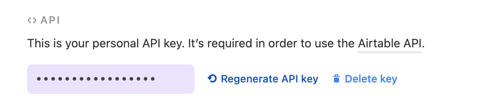

# 💨Airtable



## Connect

`apikey` can be generated in your account 



then go on the upper link and choose the workspace you wanna connect and on the Authentication section, you should see :


`database_key` is the value between `v0/` and `/` 

`table_name` is the value after the last `/` 

```python
import nass_drivers
airtable = nass_drivers.airtable.connect('api_key', 'database_key', 'table_name')
```

## Get all

```python
airtable.get(view='MyView', maxRecords=20)
```

## Insert

```python
airtable.send({'Name': 'Brian'})
```

## Search

```python
airtable.search('Name', 'Tom')
```

## Update

```python
airtable.update_by_field('Name', 'Tom', {'Phone': '1234-4445'})
```

## Delete

```python
airtable.delete_by_field('Name', 'Tom')
```

## Official documentation



