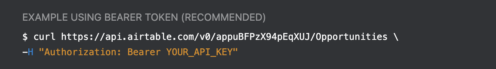

# 💨Airtable



`apikey` should be generated in your account :



You should find it there:


then go on the upper link and choose the workspace you wanna connect and on the Authentication section, you should see :



`database_key` is the value between `v0/` and `/` 

`table_name` is the value after the last `/` 

## Get

```python
import nass_drivers
api_key = "******"
database_key = "appuBFPzX94pEqXUJ"
table_name = "Opportunities"
data = nass_drivers.airtable
        .connect(api_key, database_key, table_name)
        .get(view='MyView', maxRecords=20)
```

## Send

```python
import nass_drivers
api_key = "******"
database_key = "appuBFPzX94pEqXUJ"
table_name = "Opportunities"
data = nass_drivers.airtable
        .connect(api_key, database_key, table_name)
        .send({'Name': 'Brian'})
```

## Search

```python
import nass_drivers
api_key = "******"
database_key = "appuBFPzX94pEqXUJ"
table_name = "Opportunities"
data = nass_drivers.airtable
        .connect(api_key, database_key, table_name)
        .search('Name', 'Tom')
```

## Update

```python
import nass_drivers
api_key = "******"
database_key = "appuBFPzX94pEqXUJ"
table_name = "Opportunities"
data = nass_drivers.airtable
        .connect(api_key, database_key, table_name)
        .update_by_field('Name', 'Tom', {'Phone': '1234-4445'})
```

## Delete

```python
import nass_drivers
api_key = "******"
database_key = "appuBFPzX94pEqXUJ"
table_name = "Opportunities"
data = nass_drivers.airtable
        .connect(api_key, database_key, table_name)
        .delete_by_field('Name', 'Tom')
```

## Connect


You can also save your connection and don't repeat it for each method.


```python
import nass_drivers
api_key = "******"
database_key = "appuBFPzX94pEqXUJ"
table_name = "Opportunities"
airtable = nass_drivers.airtable.connect(api_key, database_key, table_name)
data = airtable.get(view='MyView', maxRecords=20)
```

## Official documentation



