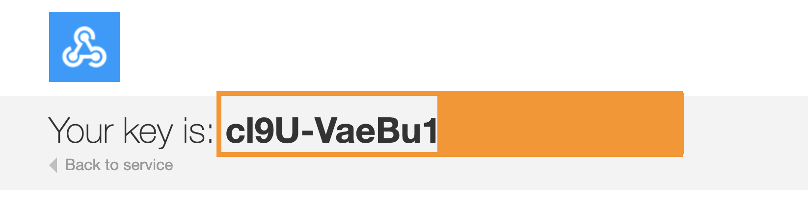

# IFTTT



Hit the documentation button to get your key :



## WebHook

```python
import naas_drivers
event = "myevent"
key = "cl9U-VaeBu1**********"
data = { "value1": "Bryan", "value2": "Helmig", "value3": 27 }
result = naas_drivers.ifttt.connect(key).send(event, data)
```

## Official documentation



