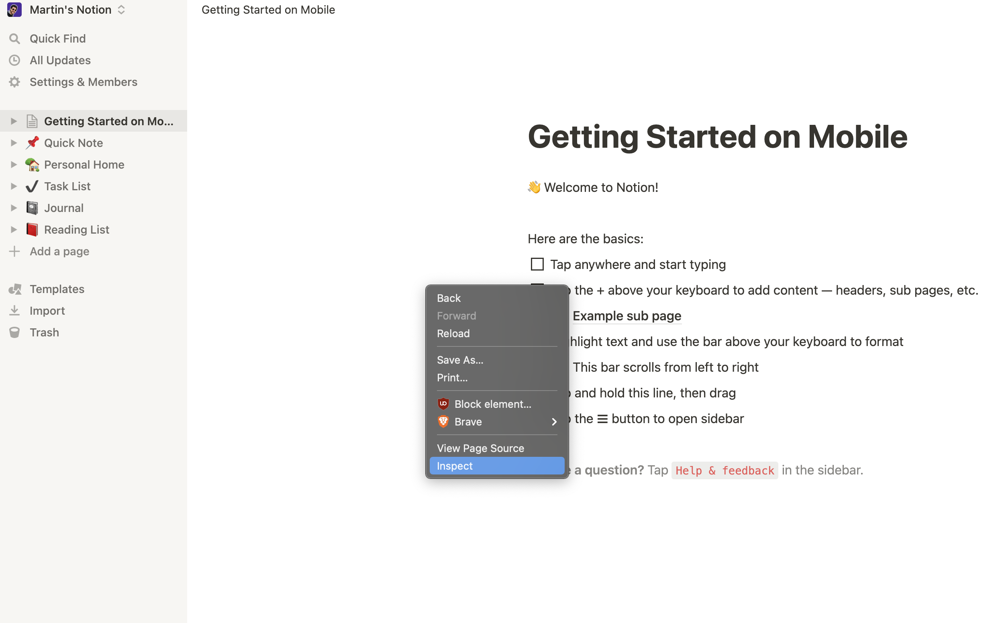
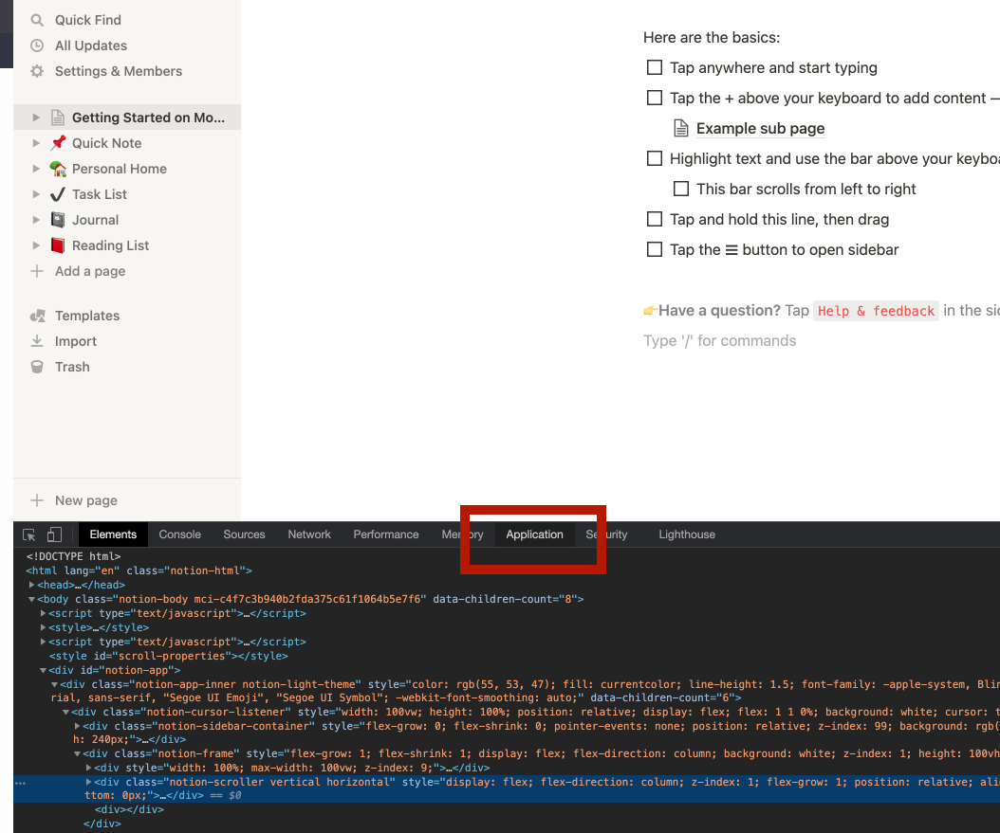
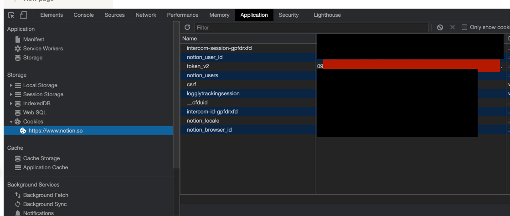

# Notion



Before start, you have to connect to your account in notion and get your session token



Click right on the notion page and select inspect



Then select the Application tab \( in the red box \)



Select the cookies section and the notion url as show in the screenshot 

Then look for the `token_v2`and copie the value on the right , this is the way to login in your notion.

## Connect


You must "Connect" before any other methods


```python
from naas_drivers import notion

# Enter your Auth token
token = "*********"

# Connect to hubspot
hs = notion.connect(token=token)
```

## Get

Get the notion page content

```python
import naas_drivers

token = "*********"
url = "https://www.notion.so/myorg/Test-c0d20a71c0944985ae96e661ccc99821"
page = naas_drivers.notion.connect(token=token).get(url)

print("The old title is:", page.title)

# Note: You can use Markdown! We convert on-the-fly to Notion's internal formatted text data structure.
page.title = "The title has now changed, and has *live-updated* in the browser!"
```

## Get collection

```python
import naas_drivers

token = "*********"
url = "https://www.notion.so/myorg/Test-c0d20a71c0944985ae96e661ccc99821"
collection_df = naas_drivers.notion.connect(token=token).get_collection(url)
```

You can also get it in raw format to be able to edit it :

```python
import naas_drivers

token = "*********"
url = "https://www.notion.so/myorg/Test-c0d20a71c0944985ae96e661ccc99821"
n = naas_drivers.notion.connect(token=token)
cv = n.get_collection(url, raw=True)

# Add a new record
row = cv.collection.add_row()
row.name = "Just some data"
row.is_confirmed = True
row.estimated_value = 399
row.files = ["https://www.birdlife.org/sites/default/files/styles/1600/public/slide.jpg"]
row.person = client.current_user
row.tags = ["A", "C"]
row.where_to = "https://learningequality.org"
```

Discover more usage with the documentation of original notion package



