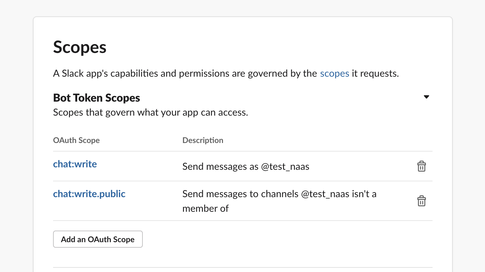
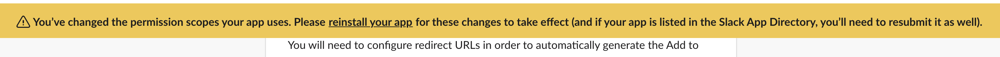
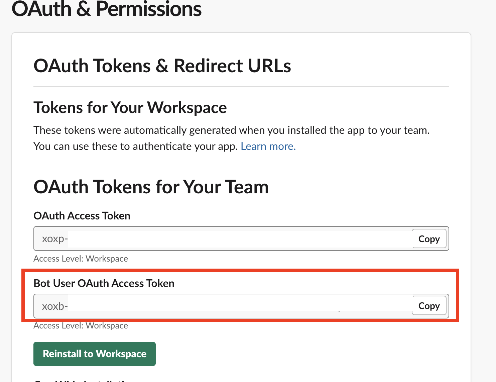

# Slack

How to get your bot token

Create app with the link below



Then go to OAuth & Permissions


Add scope to your app to allow bot to speak ****[**chat:write.public**](https://api.slack.com/scopes/chat:write.public)\*\*\*\*



Then you sould reload your app, slack should notify you like this





Copy the Bot user OAuth Access Token and use it in the connect below

## Send message

```python
import naas_drivers

token = "xoxb-***-***-****"
message = "Hello friends"
result = naas_drivers.slack.connect(token).send(message)
```

### Image

Image be url only, if you need expose asset before sending it

```python
import naas_drivers

token = "xoxb-***-***-****"
message = "Hello friends"
image = "http://i.imgur.com/c4jt321l.png")
result = naas_drivers.slack.connect(token).send(message, image=image)
```

