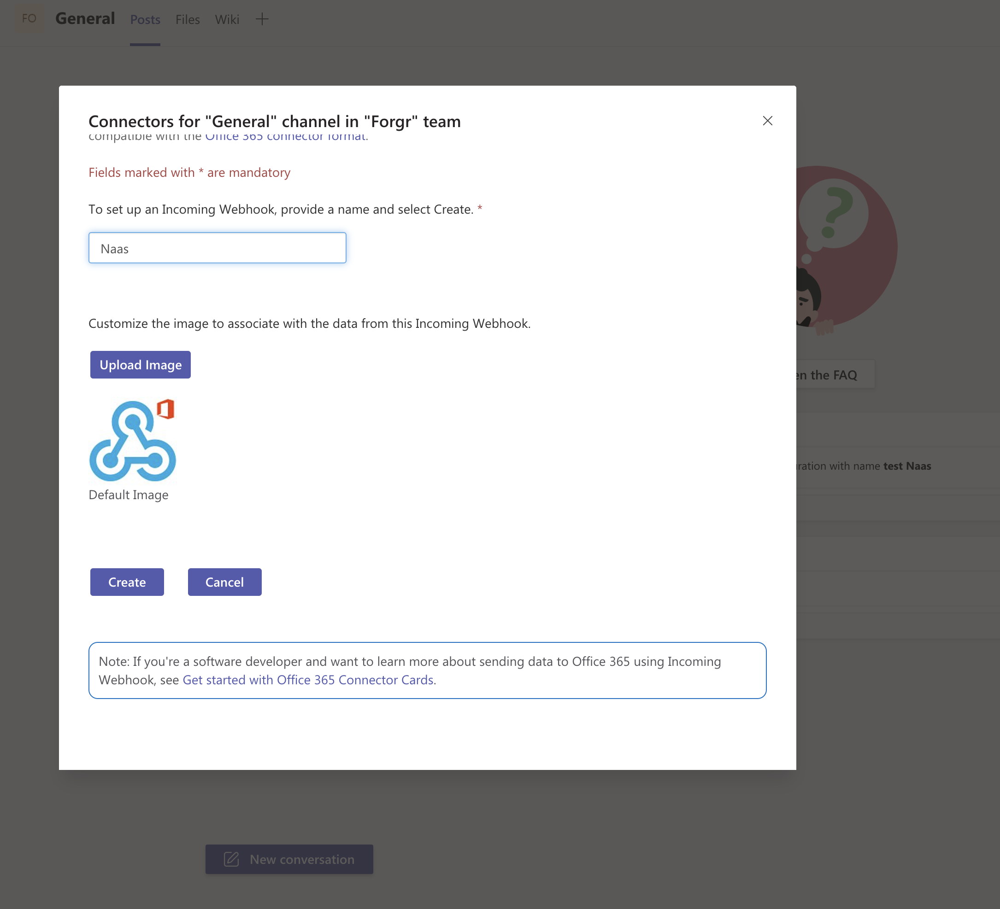
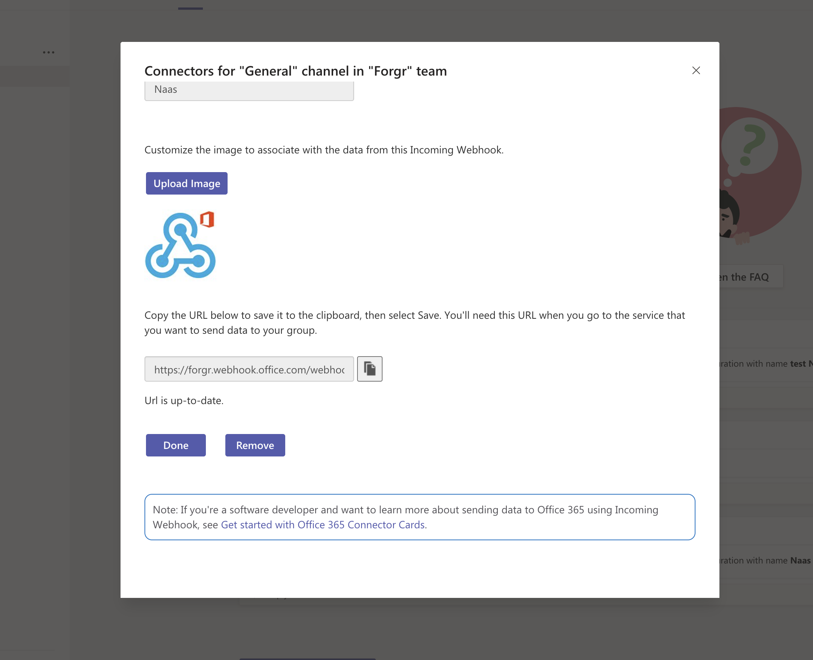

# Teams

Get your webhook url there:



Create a webwook for naas



Then you should see your webhook url



## Send message

```python
import naas_drivers

webhook = "https://COMPANY.webhook.office.com/webhookb2/****/***"
message = "Hello friends"
result = naas_drivers.teams.connect(webhook).send(message)
```

