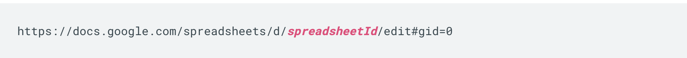

# Google Sheets





## Pre-requisite: share your Google Sheet with our service account

For the driver to fetch the contents of your google sheet, you need to share it with the service account linked with Naas.


`naas-share@naas-gsheets.iam.gserviceaccount.com`


Now you can fetch data from the sheet as a pandas data frame.

Get your `spreadsheetId` for your spreadsheet url like this :



## Get

```python
import naas_drivers
spreadsheet_id = "idd"
data = naas_drivers.gsheet.connect(spreadsheet_id).get(
    sheet_name="name"
)
```

## Send

```python
data = [{ "name": "Jean", "email": "jean@appleseed.com" }, { "name": "Bunny", "email": "bunny@appleseed.com" }]
# It accept list of dict or dataframe

spreadsheet_id = "idd"
naas_drivers.gsheet.connect(spreadsheet_id).send(
    sheet_name="TSLA",
    data=data
)
```

## Connect


You can also save your connection and don't repeat it for each method.


```python
gsheet = naas_drivers.gsheet.connect("spreadsheet_id")

name_1 = cityfalcon.get("name_1")
name_2 = cityfalcon.get("name_2")
```

## Official documentation



