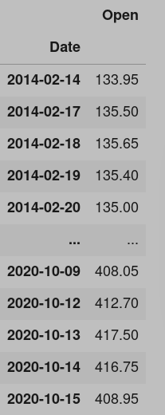

# Prediction

### Dataset

Below image is a timeseries data set having an index with datatype of datetime




### Initialize the prediction object

> This makes our prediction formula ready.

```text
pr = naas_drivers.prediction()
```

### Predict

```text
pr.predict(prediction_type="all", dataset=df, label="Open", date_column="Date", plot=True)
```

\`\`

\`\`

