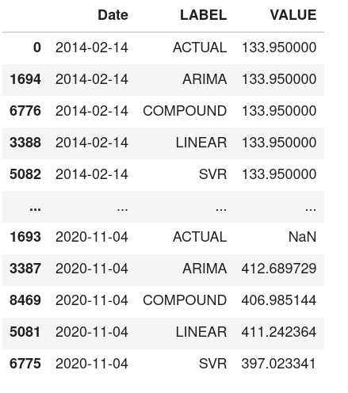
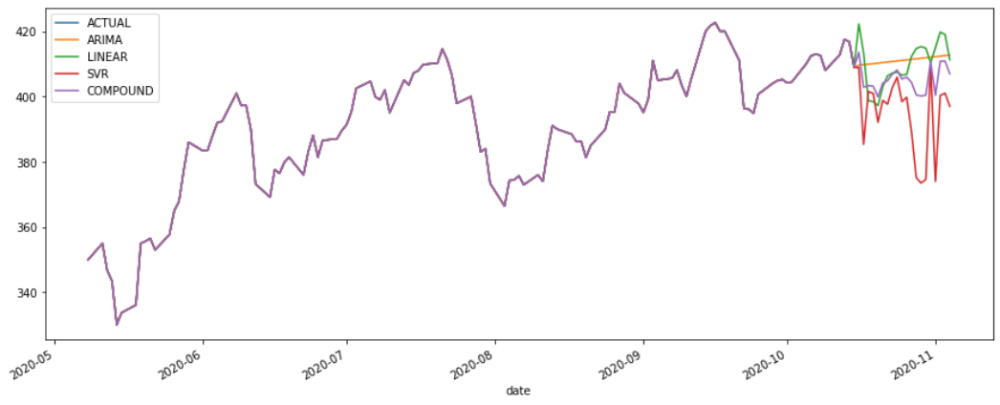

# 🔮Prediction

### Predict:

```python
naas_drivers.prediction.predict(prediction_type, dataset, label, date_column, plot)
```

> All the parameters of the above formula are explained below.

*  `prediction_type`:  
   _**The model to predict.**_  


  ```text
    Type: String
    Expected Value(one of the following): 
        1. "svr" (if SVR model is to be predicted).
        2. "linear" (if LINEAR model is to be predicted).
        3. "arima" (if ARIMA model is to be predicted).
        4. "all" (if all the above models are to be predicted).
  ```

*  `dataset`:  
   _**The data on which the prediction is to be carried out.**_  


  ```text
    Type: Dataframe (with the exact column name to be predicted and an index of datetime type).
  ```

*  `label`:  
   _**The actual value that is to be predict.**_  


  ```text
    Type: String
    Expected Value: The exact name of the column that is to be predicted, from the dataset.
  ```

*  `date_column`:  
   _**The date range from the dataset. Will be used as the output index.**_  


  ```text
    Type: String
    Expected Value: The exact name of the date column from the dataset.
  ```

*  `data_points`:  
   _**The number of days in future that are to be predict.**_  


  ```text
    Type: int
    Default Value: 20 <br> <br>
  ```

*  `plot`:  
   _**Decides whether to plot the graph or not.**_  


  ```text
    Type: Boolean
    Expected Value(one of the following): 
        1. True (If the graph is to be plot).
        2. False (If the graph is not required).
    Default Value: True
  ```

\`\`

### 2. Plot:

> Once you have predicted using the above predict formula, you can plot the predictions

```python
  naas_drivers.prediction.plot_output(data_points, plot_width, plot_height)
```

> All the parameters of the above formula are explained below.

*  `data_points`:  
   _**The number of days to plot. Days will be counted from last predicted day.**_  


  ```text
    Type: int
    Default Value: (number of days to be predicted + 7 days)
  ```

*  `plot_width`:  
   _**The width of the output plot.**_  


  ```text
    Type: int
    Default Value: 15 
  ```

*  `plot_height`:  
   _**The height of the output plot.**_  


  ```text
    Type: int
    Default Value: 6 
  ```

### Below is the example of prediction and plotting

* Below is the image of a time series dataset which is used as input data


```python
import naas_drivers
pr = naas_drivers.prediction.predict(prediction_type="all", dataset=df, label="Open", date_column="Date", plot=True)
```

> Executing the above will produce the following output



> The above output can be plotted as follows

```python
pr.plot_output()
```



