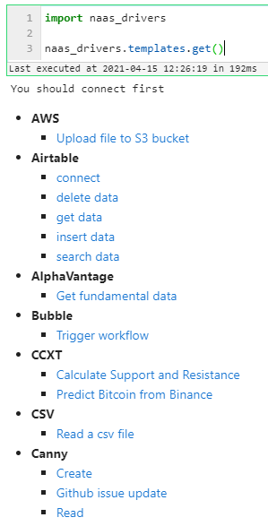

# Awesome notebook




## Get list

Get list of awesome notebooks available on github by tools.

Download it by clicking on the link after on your root folder.

```python
import naas_drivers

naas_drivers.templates.get()
```



## Create badge

Create badge for your github template 

Download awesome notebook by clicking on the badge on your root folder.

```python
import naas_drivers

file_url = "https://github.com/jupyter-naas/awesome-notebooks/blob/master/Airtable/Airtable_connect.ipynb"
naas_drivers.templates.badge(file_url)
```


