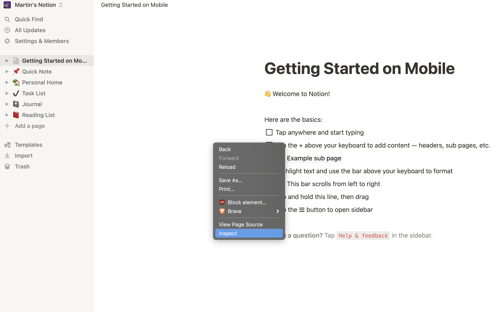
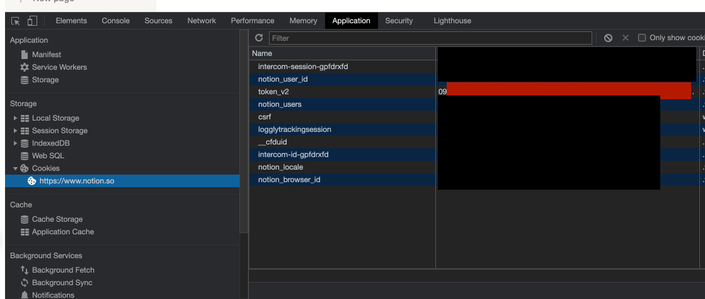

# Notion

Don't feel like reading the doc? 😅 This 3min video is made for you. 



If you are not familiar with Notion, check out their website. It's pretty amazing all-in-workspace. 

Find below is their website👇



Before anything, you have to connect to your account in notion and get your session token

First, click right on the notion page and select inspect



Then select the Application tab \(shown in the red box\)


Finally, look for the `token_v2`and copy the value on the right, this is the way to login to your Notion workspace.



## Get collection

```python
import naas_drivers

token = "*********"
url = "https://www.notion.so/myorg/Test-c0d20a71c0944985ae96e661ccc99821"
collection = naas_drivers.notion.connect(token=token).get_collection(url)
collection
```

## Create entry

```python
import naas_drivers

token = "*********"
url = "https://www.notion.so/myorg/Test-c0d20a71c0944985ae96e661ccc99821"
n = naas_drivers.notion.connect(token=token)
cv = n.get_collection(url, raw=True)

# Add a new record
row = cv.collection.add_row()
row.name = "Just some data"
row.is_confirmed = True
row.estimated_value = 399
row.files = ["https://www.birdlife.org/sites/default/files/styles/1600/public/slide.jpg"]
row.person = client.current_user
row.tags = ["A", "C"]
row.where_to = "https://learningequality.org"
```

## Other

Get the notion page content

```python
import naas_drivers

token = "*********"
url = "https://www.notion.so/myorg/Test-c0d20a71c0944985ae96e661ccc99821"
page = naas_drivers.notion.connect(token=token).get(url)

print("The old title is:", page.title)

# Note: You can use Markdown! We convert on-the-fly to Notion's internal formatted text data structure.
page.title = "The title has now changed, and has *live-updated* in the browser!"
```

### Traversing the block tree

```text
for child in page.children:
    print(child.title)

print("Parent of {} is {}".format(page.id, page.parent.id))
```

### Adding a new node

```text
from notion.block import TodoBlock

newchild = page.children.add_new(TodoBlock, title="Something to get done")
newchild.checked = True
```

### Deleting nodes

```text
# soft-delete
page.remove()

# hard-delete
page.remove(permanently=True)
```

### Create an embedded content type \(iframe, video, etc\)

```text
from notion.block import VideoBlock

video = page.children.add_new(VideoBlock, width=200)
# sets "property.source" to the URL, and "format.display_source" to the embedly-converted URL
video.set_source_url("https://www.youtube.com/watch?v=oHg5SJYRHA0")
```

### Create a new embedded collection view block

```text
collection = client.get_collection(COLLECTION_ID) # get an existing collection
cvb = page.children.add_new(CollectionViewBlock, collection=collection)
view = cvb.views.add_new(view_type="table")

# Before the view can be browsed in Notion, 
# the filters and format options on the view should be set as desired.
# 
# for example:
#   view.set("query", ...)
#   view.set("format.board_groups", ...)
#   view.set("format.board_properties", ...)
```

### Moving blocks around

```text
# move my block to after the video
my_block.move_to(video, "after")

# move my block to the end of otherblock's children
my_block.move_to(otherblock, "last-child")

# (you can also use "before" and "first-child")
```

### Lock/Unlock A Page

```text
# The "locked" property is available on PageBlock and CollectionViewBlock objects
# Set it to True to lock the page/database
page.locked = True
# and False to unlock it again
page.locked = False
```

You can also get it in raw format to be able to edit it :

Discover more usage with the documentation of original notion package



